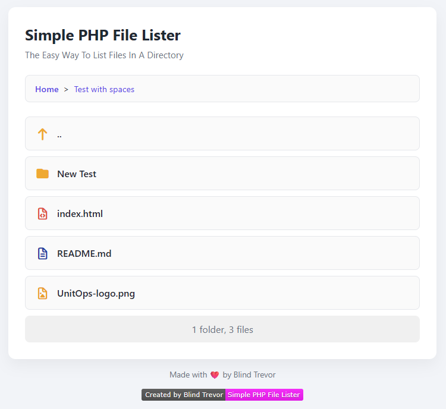

# Simple PHP File Lister

A lightweight, no-configuration PHP file directory lister with a clean, modern interface and file-type icons.

Just drop the `index.php` file into any directory on a PHP-enabled server and it will automatically list all files in that folder. No setup, no config files, no dependencies.

Perfect for sharing downloads, documents, or quick internal file access.



---

## Version Information

The current version of Simple PHP File Lister can be found in the `index.php` file (APP_VERSION constant) or displayed in the footer of the application interface.

### Automatic Version Updates
This project uses automated versioning through GitHub Actions. When code is merged into the `main` branch, the version number is automatically incremented and a new release is created.

- **Version format**: `MAJOR.MINOR.PATCH` (semantic versioning)
- **Automatic increment**: PATCH version is auto-incremented on each main branch merge
- **Manual updates**: MAJOR and MINOR versions should be updated manually for significant changes
- **Releases**: Automatically created with each version bump on the [releases page](https://github.com/BlindTrevor/SimplePhpFileLister/releases)

### Version File
The version information is embedded in `index.php` and includes:
- `APP_VERSION` - Current version number (e.g., "1.0.0")

---

## Features

- ✅ **Zero configuration** — works immediately
- 📁 **Automatically lists files and subdirectories** with breadcrumb navigation
- 📄 **Pagination** — configurable threshold for large directories (default: 25 items per page)
- 🔢 **Adjustable pagination amount** — dynamically change items per page (5, 10, 20, 30, 50, or All) with dropdown selector
- ☑️ **Multi-select with batch actions** — select multiple files/folders and download as ZIP or delete them all at once
- 🔒 **Security-hardened** — protects against path traversal, code execution, and other vulnerabilities
- 🚫 **Smart exclusions** — hides hidden files (starting with `.`), system files, and dangerous executables
- 🎨 **Modern, responsive design** — works beautifully on desktop, tablet, and mobile
- 🎭 **Multiple theme options** — choose from 5 built-in themes (Purple, Blue, Green, Dark, Light)
- 🖼 **File-type icons & color coding** powered by Font Awesome
- 👁️ **Hover previews** — see thumbnails of images, videos, audio, and PDFs before downloading
- ✏️ **Rename files and folders** — easily rename items directly from the web interface (optional, configurable)
- 🗑️ **Delete files and folders** — remove items with confirmation dialog (optional, configurable)
- 📥 **Secure downloads** — individual file downloads with proper content-type headers
- 📦 **Download All as ZIP** — bundle entire directories into a single ZIP file
- 📊 **File statistics** — displays folder/file counts and total size
- 📏 **Human-readable file sizes** — automatically formats bytes to KB, MB, GB, etc.
- ⚡ **Single self-contained file** — no external dependencies except Font Awesome CDN

---

## Security

SimplePhpFileLister is designed with security as a top priority. Here's why you can trust it in production environments:

### Path Traversal Protection
- Uses `realpath()` to resolve and validate all file paths
- Strictly enforces access within the configured root directory
- Prevents `../` directory traversal attacks and symlink exploits
- Validates paths with `DIRECTORY_SEPARATOR` suffix to prevent edge-case bypasses

### Code Execution Prevention
- Blocks download of dangerous file extensions (`.php`, `.phar`, `.sh`, `.exe`, `.bat`, etc.)
- Prevents direct execution of server-side scripts through the file lister
- Hides these files from directory listings entirely

### Input Sanitization
- All user inputs are properly escaped using `htmlspecialchars()` with `ENT_QUOTES | ENT_SUBSTITUTE`
- File paths are validated before any file system operations
- Download filenames are sanitized to prevent header injection attacks

### Security Headers
- **Content Security Policy (CSP)** — prevents XSS attacks with strict script/style policies
- **X-Content-Type-Options: nosniff** — prevents MIME type sniffing
- **X-Frame-Options: DENY** — prevents clickjacking attacks
- **Referrer-Policy: no-referrer** — prevents referrer information leakage
- **Permissions-Policy** — restricts access to sensitive browser features

### Privacy & Information Disclosure
- Hidden files (starting with `.`) are automatically excluded from listings
- The `index.php` file itself is never shown or downloadable
- Symlinks are ignored to prevent unintended access
- No directory listing is exposed for invalid paths

### Secure Download & Preview Handlers
- Downloads use `Content-Disposition: attachment` to force save-as dialog
- Preview handler only allows whitelisted MIME types (images, videos, audio, PDF)
- Streaming uses `fpassthru()` to efficiently handle large files without loading into memory
- Temporary files (ZIP downloads) are securely cleaned up after use
- Cryptographically secure nonces (`random_bytes()`) for CSP inline scripts/styles

### Additional Safeguards
- Natural case-insensitive sorting prevents directory structure leakage patterns
- File operations fail safely without exposing error details
- No database or persistent storage reduces attack surface
- All PHP code is contained in a single auditable file

---

## Requirements

- PHP 7.0 or later (PHP 7.4+ recommended)
- A web server capable of running PHP (Apache, Nginx, etc.)
- Optional: ZipArchive PHP extension for "Download All as ZIP" feature (typically included in standard PHP installations)

---

## Installation

1. Download the latest version:
   - Visit the [releases page](https://github.com/BlindTrevor/SimplePhpFileLister/releases)
   - Download the latest `index.php` file
   - Alternatively, download the source code ZIP from the latest release and extract `index.php`

2. Copy the `index.php` file into the directory you want to list.

3. Upload the directory to your PHP-enabled web server.

4. Visit the directory in your browser.

That's it - the file list will render automatically with version information displayed in the footer. **Everything is self-contained in a single PHP file!**

### Updating to a New Version

To update to a newer version:
1. Download the new `index.php` file from the [releases page](https://github.com/BlindTrevor/SimplePhpFileLister/releases)
2. Replace your existing `index.php` with the new one
3. Your configuration settings will need to be re-applied (see Customization section)

**Tip**: Before updating, document your custom settings (title, subtitle, feature flags, etc.) so you can easily re-apply them to the new version.

---
---

---

## How It Works

- Uses PHP's `opendir()` and `readdir()` functions to scan the current directory
- Validates all paths using `realpath()` to prevent directory traversal attacks
- Supports subdirectory navigation with breadcrumb trails for easy navigation
- Files are naturally sorted (case-insensitive) for better organization
- Individual file downloads are handled through a secure download handler
- Preview functionality loads images, videos, and audio files on hover (desktop only)
- "Download All as ZIP" feature recursively bundles directory contents
- All styling and logic are embedded directly in the file — only Font Awesome is loaded from CDN
- Responsive CSS adapts the layout for desktop, tablet, and mobile screens
- JavaScript provides smooth loading overlays and preview tooltips

---

## Customization

All configuration settings are centralized in the **CONFIGURATION** section at the top of the `index.php` file (lines 18-50). This makes it easy to customize the behavior and appearance of your file lister without hunting through the code.

### Configuration Sections

The configuration is organized into clear groups:

1. **Display Customization** — Page title, subtitle, and footer text
2. **Pagination Settings** — Control when pagination appears
3. **Feature Toggles** — Enable/disable rename, delete, and download features
4. **Display Options** — Control what information is shown
5. **Theme Settings** — Set default theme and theme change permissions
6. **Advanced Options** — Hidden files and ZIP compression settings

### How to Customize

Simply open `index.php` in a text editor and locate the **CONFIGURATION** section near the top. Each setting includes clear comments explaining its purpose and valid values.

### Configuration Options

- **Pagination settings**  
  Control pagination behavior with these configuration variables:
  ```php
  $paginationThreshold = 25; // Number of items per page before pagination appears (legacy)
  $enablePaginationAmountSelector = true; // Enable/disable pagination amount selector dropdown
  $defaultPaginationAmount = 25; // Default items per page (5, 10, 20, 30, 50, or 'all')
  ```
  - `$paginationThreshold` — Legacy setting for when pagination appears (kept for backward compatibility)
  - `$enablePaginationAmountSelector` — When `true`, displays a dropdown selector next to the breadcrumb navigation that allows users to choose how many items to display per page. When `false`, the dropdown is hidden and only the default pagination amount is used.
  - `$defaultPaginationAmount` — Sets the default number of items per page. Can be set to 5, 10, 20, 30, 50, or 'all'. This value is used when the user hasn't selected a different amount via the dropdown.
  
  **How it works:** Users can dynamically change the number of items displayed per page using the dropdown selector positioned to the right of the breadcrumb navigation. Options include 5, 10, 20, 30, 50 items per page, or "All" to display everything on a single page. The selection is preserved in the URL and persists across page navigation within the same directory.

- **Rename functionality**  
  Enable or disable the rename feature by changing the `$enableRename` variable in the CONFIGURATION section:
  ```php
  $enableRename = true;  // Set to false to disable rename functionality
  ```
  When enabled, a rename button (pencil icon) appears when hovering over files and folders, allowing you to rename them directly from the interface.

- **Delete functionality**  
  Enable or disable the delete feature by changing the `$enableDelete` variable in the CONFIGURATION section:
  ```php
  $enableDelete = true;  // Set to false to disable delete functionality
  ```
  When enabled, a delete button (trash icon) appears when hovering over files and folders, allowing you to delete them after confirmation. **Warning: Deleted files cannot be recovered.**

- **Download & Export Configuration**  
  Control download functionality with these configuration variables:
  ```php
  $enableDownloadAll = true;      // Enable/disable "Download All as ZIP" button
  $enableBatchDownload = true;    // Enable/disable batch download of selected items as ZIP
  $enableIndividualDownload = true; // Enable/disable individual file downloads
  ```
  - When `$enableDownloadAll` is `false`, the "Download All as ZIP" button is hidden and the endpoint returns 403 Forbidden if accessed.
  - When `$enableBatchDownload` is `false`, multi-select controls are hidden and batch download endpoint returns 403 Forbidden if accessed.
  - When `$enableIndividualDownload` is `false`, file download links are still visible but clicking them returns 403 Forbidden.

- **Display Configuration**  
  Control what information is displayed in the interface:
  ```php
  $showFileSize = true;           // Show/hide file sizes in file listings
  $showFolderFileCount = true;    // Show/hide folder/file count statistics
  $showTotalSize = true;          // Show/hide total size in statistics
  ```
  - When `$showFileSize` is `false`, file sizes are not displayed next to file names in the listing.
  - When `$showFolderFileCount` is `false`, the folder and file count is not displayed in the statistics container.
  - When `$showTotalSize` is `false`, the total size is not displayed in the statistics (even if `$showFolderFileCount` is `true`).

- **Advanced Options**  
  Configure advanced behaviors:
  ```php
  $includeHiddenFiles = false;    // Include hidden files (starting with .) in listings
  $zipCompressionLevel = 6;       // ZIP compression level (0-9, where 0=no compression, 9=maximum)
  ```
  - When `$includeHiddenFiles` is `true`, files and folders starting with `.` (except `.` and `..`) are included in listings and ZIP downloads. **Warning: This may expose sensitive files.**
  - `$zipCompressionLevel` controls compression for ZIP downloads. Level 0 = no compression (fastest), 9 = maximum compression (smallest size), 6 = balanced (default).

- **Theme Configuration**  
  Customize the visual appearance with multiple theme options:
  ```php
  $defaultTheme = 'purple';       // Default theme: 'purple', 'blue', 'green', 'dark', 'light'
  $allowThemeChange = true;       // Allow users to change the theme via settings icon
  ```
  - `$defaultTheme` sets the initial theme when users first visit. Available themes:
    - `purple` — Purple gradient (default)
    - `blue` — Blue gradient
    - `green` — Green gradient
    - `dark` — Dark mode with gray tones
    - `light` — Light mode with minimal colors
  - `$allowThemeChange` controls whether users can change themes using the floating settings button. When set to `false`, the theme settings button is hidden and users cannot change themes. When set to `true`, a floating settings icon appears in the bottom-right corner allowing users to select their preferred theme. Theme preferences are saved in the browser's localStorage and persist across visits.

- **Title, subtitle & footer**  
  Change the `$title`, `$subtitle`, and `$footer` variables in the CONFIGURATION section.

- **Styling**  
  Modify the CSS variables in the `<style>` block (in the `:root` selector) to adjust colors, spacing, or fonts:
  - `--bg` — Background gradient
  - `--card` — Card background color
  - `--accent` — Primary accent color
  - `--text` — Main text color
  - `--muted` — Secondary text color

- **Blocked file extensions**  
  Edit the `BLOCKED_EXTENSIONS` constant (located after the CONFIGURATION section) to add or remove file types that should be hidden and blocked from download.

- **Preview file types**  
  Modify the `getPreviewableFileTypes()` function and the MIME type arrays in both the fast-path preview handler and the `getPreviewMimeType()` function to support additional preview formats.

- **Root directory**  
  By default, files are listed from the directory where `index.php` resides. To change this, modify the `$realRoot` variable in the Security Configuration section (after CONFIGURATION):
  ```php
  $realRoot = rtrim(realpath('.'), DIRECTORY_SEPARATOR) . DIRECTORY_SEPARATOR;
  ```

---

## Themes

Simple PHP File Lister includes 5 beautiful built-in themes to customize the visual appearance of your file listing.

### Available Themes

- **Purple (Default)** — A vibrant purple-to-magenta gradient with modern styling
- **Blue** — A fresh cyan-to-blue gradient for a cool, professional look
- **Green** — A natural teal-to-green gradient for an organic feel
- **Dark** — A sleek dark mode with gray tones, perfect for low-light environments
- **Light** — A minimal light theme with subtle gradients and clean aesthetics

### Changing Themes

Users can change themes in two ways:

1. **Via Settings Icon** (when `$allowThemeChange` is `true`):
   - Click the floating palette icon in the bottom-right corner
   - Select your preferred theme from the modal
   - The theme preference is saved automatically in your browser

2. **Via Configuration** (for site-wide default):
   - Edit the `$defaultTheme` variable in `index.php`
   - Set to one of: `'purple'`, `'blue'`, `'green'`, `'dark'`, or `'light'`

### Configuration Options

Control theme behavior with these settings:

```php
$defaultTheme = 'purple';       // Set the default theme
$allowThemeChange = true;       // Allow/disallow user theme changes
```

- **`$defaultTheme`** — Sets the initial theme for all users. This theme is applied on first visit before any user preference is set.
- **`$allowThemeChange`** — When `true`, shows a floating settings icon that allows users to change themes. When `false`, hides the settings icon and locks the theme to `$defaultTheme`.

### Theme Persistence

When users change themes (and `$allowThemeChange` is `true`), their preference is stored in the browser's localStorage. This means:
- The selected theme persists across page reloads and navigation
- Theme preferences are per-browser (not shared across devices)
- Clearing browser data will reset the theme to `$defaultTheme`

### Disabling Theme Changes

To lock the theme and prevent user customization:

```php
$allowThemeChange = false;  // Disable theme changing
```

This is useful for:
- Maintaining consistent branding across all users
- Simplifying the interface for basic deployments
- Corporate environments with strict design guidelines

---

## Rename Feature

The rename feature allows you to rename files and folders directly from the web interface.

### How to Use

1. Hover over any file or folder in the list to reveal the rename button (pencil icon)
2. Click the rename button to open the rename dialog
3. Enter the new name for the file or folder
4. Click "Rename" to confirm, or "Cancel" to abort

### Security & Validation

The rename feature includes robust security measures:

- **Path traversal prevention** — Cannot use `/`, `\`, or null bytes in names
- **Extension protection** — Prevents renaming files to dangerous extensions (`.php`, `.exe`, etc.)
- **Hidden file protection** — Cannot rename to hidden files (starting with `.`)
- **System file protection** — Cannot rename `index.php` or hidden files
- **Duplicate detection** — Prevents overwriting existing files or folders
- **Input sanitization** — All inputs are validated and sanitized

### Configuration

The rename feature can be enabled or disabled via the `$enableRename` configuration variable:

```php
$enableRename = true;  // Set to false to disable rename functionality
```

When disabled:
- Rename buttons are hidden from the UI
- Backend rename endpoint returns 403 Forbidden if accessed

### Error Handling

The rename dialog displays helpful error messages for common issues:
- "A file or folder with this name already exists" — when the target name conflicts
- "Invalid file name" — when the name contains invalid characters
- "Cannot rename to this file type" — when trying to rename to a blocked extension
- "Failed to rename item" — when the filesystem operation fails

---

## Delete Feature

The delete feature allows you to permanently delete files and folders directly from the web interface.

### How to Use

1. Hover over any file or folder in the list to reveal the delete button (trash icon)
2. Click the delete button to open the confirmation dialog
3. Review the warning message about permanent deletion
4. Click "Delete" to confirm, or "Cancel" to abort

### Security & Validation

The delete feature includes robust security measures:

- **Path traversal prevention** — Validates all paths to prevent unauthorized access
- **System file protection** — Cannot delete `index.php` or hidden files (starting with `.`)
- **Recursive deletion** — Automatically handles folder deletion with all contents
- **Confirmation required** — Always prompts for confirmation before deleting
- **Input validation** — All paths are validated before any deletion occurs

### Configuration

The delete feature can be enabled or disabled via the `$enableDelete` configuration variable:

```php
$enableDelete = true;  // Set to false to disable delete functionality
```

When disabled:
- Delete buttons are hidden from the UI
- Backend delete endpoint returns 403 Forbidden if accessed

### Important Warnings

⚠️ **IRREVERSIBLE ACTION**: Deleted files and folders cannot be recovered. They are permanently removed from the filesystem.

⚠️ **NO TRASH/RECYCLE BIN**: Unlike operating systems with a trash bin, deletions are immediate and permanent.

⚠️ **FOLDER DELETION**: When deleting a folder, all its contents (files and subfolders) are also permanently deleted.

### Best Practices

1. **Enable only when needed** — Keep delete functionality disabled unless actively required
2. **Use server backups** — Ensure regular backups are in place before enabling delete
3. **Limit access** — Use web server authentication (`.htaccess`, HTTP Basic Auth) to restrict access
4. **Test carefully** — Test in a safe environment before using in production
5. **Review permissions** — Ensure filesystem permissions match your security requirements

### Error Handling

The delete dialog displays helpful error messages:
- "File or folder not found" — when the target doesn't exist
- "Cannot delete this item" — when trying to delete protected files
- "Delete functionality is disabled" — when the feature is turned off
- "Failed to delete item" — when the filesystem operation fails

---

## Multi-Select Feature

The multi-select feature allows you to perform batch operations on multiple files and folders at once.

### How to Use

1. **Select items** — Click the checkboxes next to files or folders you want to select
2. **Select All** — Use the "Select All" checkbox to quickly select all items in the current directory
3. **View selection** — The selected count and total file size are displayed in the action bar (e.g., "2 selected (1.5 MB)")
4. **Batch actions** — Choose from the available batch operations:
   - **Download as ZIP** — Download all selected items as a single ZIP file
   - **Delete Selected** — Delete all selected items at once (only visible if deletion is enabled)

### Features

- **Individual selection** — Select specific files and folders using checkboxes
- **Select All/Deselect All** — Toggle selection of all items with a single click
- **Visual feedback** — Selected items are clearly indicated with checked boxes
- **Selection count with total size** — Always know how many items are selected and their combined size
- **Mixed state** — The "Select All" checkbox shows an indeterminate state when some (but not all) items are selected
- **Responsive design** — Works seamlessly on desktop, tablet, and mobile devices

### Batch Download

When you click "Download as ZIP":
- All selected files and folders are packaged into a single ZIP file
- The ZIP file is named `selected_files.zip`
- Folders are included with their complete directory structure
- Download opens in a new tab to avoid interrupting your browsing
- Blocked file extensions are automatically excluded for security

### Batch Delete

When you click "Delete Selected" (if deletion is enabled):
- A confirmation dialog appears showing the number of items to be deleted
- All selected files and folders are permanently deleted after confirmation
- Folders are deleted recursively with all their contents
- Protected files (index.php, hidden files) are skipped automatically
- Error messages indicate which items couldn't be deleted, if any
- Page reloads automatically after successful deletion

### Security

Batch operations maintain the same security standards as individual operations:
- **Path traversal protection** — All paths are validated before processing
- **Permission checks** — System files and protected items are automatically skipped
- **Extension blocking** — Dangerous file types are never included in ZIP downloads
- **Input validation** — All selections are validated on the server side
- **Safe deletion** — Recursive deletion includes safety checks at every level

### Notes

- The multi-select controls only appear when there are items to select
- Batch operations work across pagination — only visible items can be selected
- Selecting items does not interfere with single-item operations (rename, delete, download)
- The action bar appears/disappears automatically based on selection state
- On mobile devices, buttons stack vertically for better usability

---

## Notes

- Files and directories are sorted naturally (case-insensitive) for better organization
- Pagination automatically appears when the number of items exceeds the selected amount
- Pagination amount selector (when enabled) allows users to choose 5, 10, 20, 30, 50, or All items per page
- The selected pagination amount is preserved in the URL and persists across directory navigation
- Pagination preserves the current directory path when navigating between pages
- Multi-select controls automatically appear when there are files or folders to select
- No authentication is built-in — use web server authentication (`.htaccess`, HTTP Basic Auth) if needed
- Hover previews only work on desktop devices with mouse support (disabled on touch-only devices)
- Rename and delete buttons appear on hover on desktop; always visible on mobile/touch devices
- ZIP download feature requires the ZipArchive PHP extension (enabled by default on most PHP installations)
- Preview handler is optimized for performance — it's placed at the top of the script and exits immediately
- Hidden files (starting with `.`) and dangerous executables are automatically excluded from listings
- **Delete operations are permanent** — deleted files cannot be recovered, so use this feature carefully

---

## License

Free to use, modify, and redistribute.

---

**Simple PHP File Lister**  
© Andrew Samuel 2026
## Version Management (For Contributors)

This project uses automated semantic versioning to track releases.

### How It Works

1. **Version Storage**: The version number is stored directly in `index.php` as constants:
   - `APP_VERSION` (e.g., "1.0.0")
   - `APP_VERSION_DATE` (e.g., "2026-01-09")

2. **Automatic Increment**: When code is merged into the `main` branch:
   - GitHub Actions automatically increments the PATCH version (e.g., 1.0.0 → 1.0.1)
   - The date is updated to the current date
   - Changes are committed back to the repository
   - A Git tag is created (e.g., `v1.0.1`)
   - A GitHub Release is automatically published

3. **Manual Updates**: For MAJOR or MINOR version changes:
   - Edit the `APP_VERSION` constant in `index.php` manually
   - Update the version in the PHPDoc comment at the top (`@version`)
   - Commit with a descriptive message explaining the version bump
   - The automated system will continue incrementing from the new base

### Semantic Versioning

- **MAJOR** (X.0.0): Breaking changes or major feature overhauls
- **MINOR** (x.Y.0): New features or significant improvements (backward compatible)
- **PATCH** (x.y.Z): Bug fixes and minor improvements (automatically incremented)

### Skipping Auto-Version

To prevent automatic version increment for a specific merge, include `[skip-version]` or `[no-version]` in your commit message.

Example:
```
docs: update README with clarifications [skip-version]
```

### Version Display

The version is displayed in the footer of the application interface, helping users identify which version they're running for support and debugging purposes.

---
